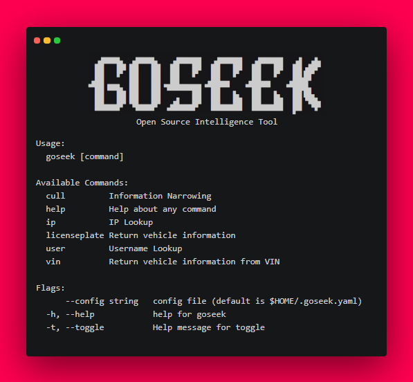

<!-- PROJECT LOGO -->
 

  

  <h3 align="center">GoSeek</h3>
  

    
     
    
    
    
    
  

  

    OSINT & OPSEC
     
    <!-- <a href="https://github.com/othneildrew/Best-README-Template"><strong>Explore the docs »</strong></a> -->
     

<!-- TABLE OF CONTENTS -->

  
Table of Contents

  <ol>
    <li>
      <a href="#about-the-project">About The Project</a>
    </li>
    <li><a href="#installation-and-usage">Installation and Usage</a></li>
  </ol>

<!-- ABOUT THE PROJECT -->
## About The Project

</img>

**I have always found Open-Source Intelligence and Operations Security to be intriguing. I started learning Golang in the beginning of February of 2021 and have been looking for new projects to help strengthen my knowledge. I also wanted these projects to keep me engaged over time and prove somewhat useful instead of making just another calculator. I hope to build on GoSeek and expand it's use cases in a way that others can benefit**

Features:

- [x] Username Lookup - Inspired by [Sherlock](https://github.com/sherlock-project/sherlock), includes account deletion sites.
- [x] IP Lookup - Uses [ip-api](https://ip-api.com/)
- [x] License Plate & VIN Lookup - Uses [htmlquery](https://github.com/antchfx/htmlquery)
- [x] Info Cull - Data narrowing using [gofpdf](https://github.com/jung-kurt/gofpdf), inspired by [HINTS](https://github.com/jadekeys/hints)
- [x] Fake Identity Generator - Name, Location, Date of Birth, Username, and Password 
- [ ] Email Lookup (site associations, breaches, etc...) 

<!-- USAGE EXAMPLES -->
## Installation and Usage

Download via 'go get':
<code>go get -u github.com/audioo/goseek</code>  
Run in terminal:
<code>goseek</code>
