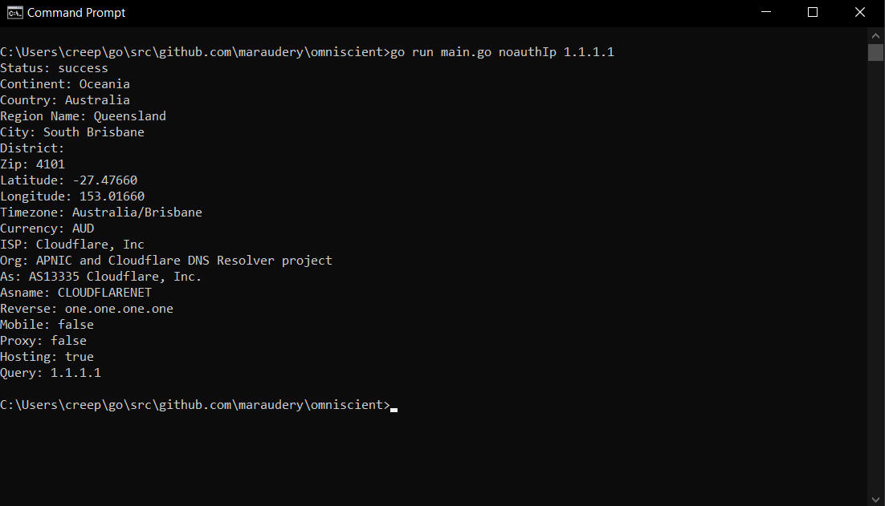
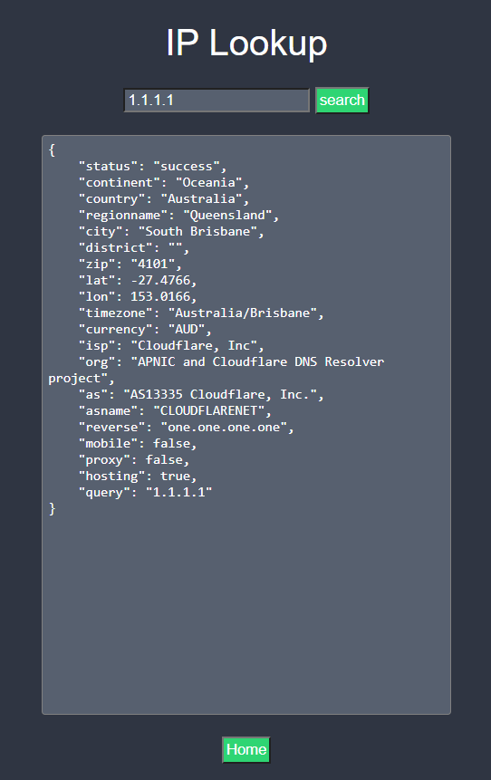

<p align="center">
  <a></a>
  <h1 align="center">Bitcrook</h1>
  <h2 align="center">Important: In early development, looking for contributors/maintainers.</h2>
  <p align="center">
    <a href="https://goreportcard.com/report/github.com/audioo/bitcrook"></a>
    <a></a>
    <a></a>
    <a href="https://discord.com/invite/uVWJUTufqf"></a><br>
    Centralize and expedite OSINT investigations<br>
  <a href="https://github.com/users/audioo/projects/1">Roadmap</a> | <a href="https://bitcrook.tech">Documentation</a><br>
</a>
  </p><br>
</p>

## Table of Contents

- [Information](#information)
  - [About](#about)
  - [Disclaimer](#disclaimer)
  - [Preview](#preview)
  - [Attributions](#attributions)
- [Usage](#usage)
  - [Installation](#installation)
  - [CLI](#cli)
  - [GUI](#gui)
  - [Implementation](#implementation)
  - [Testing](#testing)
- [Package Types](#package-types) *a-z*
  - [Court Cases](#court-cases)
  - [Discord](#discord)
  - [IP Address](#ip-address)
  - [Multi-Use](#multi-use)
  - [Tax ID](#tax-id)
  - [Username](#username)
  - [Vehicle](#vehicle)

## Information

### About

Bitcrook is an open-source intelligence apparatus that aims to centralize all of the tools necessary to carry out an investigation. Although investigations will still require human interaction to connect the dots, the interface can be tailored to an individual’s needs to expedite the process of due diligence. Some packages do require an authentication key and others do not. See the [Package Types](#package-types) tables for more information. Bitcrook can be integrated within your application OR it can be used directly from the [terminal/web browser.](#preview)

### Disclaimer

It is the end user's responsibility to obey all applicable local, state, and federal laws. Developers assume no liability and are not responsible for any misuse or damage caused by this program. By using Bitcrook, you agree to the previous statements.

### Preview

<a></a>
<a></a>

### Attributions

[Social Preview](./images/card.jpg) created with [Canva.](https://www.canva.com/)

## Usage

### Installation

 - Fetch the repository via 'git clone': `git clone https://github.com/audioo/bitcrook.git`

### CLI 

1. Navigate to the root directory of Bitcrook via `cd`
2. In your preferred terminal, enter and run: `go run main.go`
3. After running the aforementioned command, all dependencies will be installed and usage help will be printed to the console.

### GUI

1. From the root directory of Bitcrook, navigate into the `api` directory via `cd`
2. In your preferred terminal, enter and run: `go run server.go`
3. A pop-up should appear requesting network access, allow it.
4. In your preferred web browser, navigate to `http://localhost:6174`

### Implementation

Instructions/Documentation are provided for each and every package, all you have to do is find what you need in the [Package Types](#package-types) section.

### Testing

Bitcrook is currently passing all tests; however, I have provided instructions for properly running the tests if you would like to do so. Some tests may not function properly without their corresponding API keys.

1. In the root directory of Bitcrook, create a file named `keyconfig.json`
2. In `keyconfig.json`, paste the following text:
``` json
{
    "melissaKeyCred": "Paste Melissa Key with Credits Here",
    "hibpKey": "Paste Have I Been Pwned Key Here",
    "dataGovKey": "Paste Data.gov Key Here"
}
```
3. Paste in your API keys. The test will fail without a valid API key.
4. In your preferred terminal, enter and run `go test ./...`

## Package-Types

### Court Cases

| Package                                                                                    | Description                                  |   Auth   | Location | Status |
| :----------------------------------------------------------------------------------------: | -------------------------------------------- | :------: | -------- | :----: |
| [Case Law](https://github.com/audioo/bitcrook/tree/main/pkg/noauth/caselaw)           | Court Case Search                            |  `none`  | US | Functioning | 

### Discord

| Package                                                                                    | Description                                  |   Auth   | Location | Status |
| :----------------------------------------------------------------------------------------: | -------------------------------------------- | :------: | -------- | :----: |
| [Discord Token Lookup](https://github.com/audioo/bitcrook/tree/main/pkg/noauth/discord)           | Returns information regarding the passed token.                            |  `none`  | Global | Functioning | 

### IP Address

| Package                                                                                    | Description                                  |   Auth   | Location | Status |
| :----------------------------------------------------------------------------------------: | -------------------------------------------- | :------: | -------- | :----: |
| [IPV4 Address Lookup](https://github.com/audioo/bitcrook/tree/main/pkg/noauth/ip)     | IPV4 Address Lookup                          |  `none`  | Global | Functioning |

### Multi-Use

| Package                                                                                    | Description                                  |   Auth   | Location | Status |
| :----------------------------------------------------------------------------------------: | -------------------------------------------- | :------: | -------- | :----: |
| [Have I Been Pwned](https://github.com/audioo/bitcrook/tree/main/pkg/authpaid/hibp)   | Email and Password Vulnerability - (Breaches)|  `paid`  | Global | Functioning |
| [Melissa](https://github.com/audioo/bitcrook/tree/main/pkg/authfree/melissa)          | Lookups - Email, Phone Number, IP Address    |  `free`  | US | Functioning |
| [IP2LOCATION](https://github.com/audioo/bitcrook/tree/main/pkg/authfree/ip2location)           | Whois Lookup, IP Lookup              |  `free`  | - | Functioning | 

### Tax ID

| Package                                                                                    | Description                                  |   Auth   | Location | Status |
| :----------------------------------------------------------------------------------------: | -------------------------------------------- | :------: | -------- | :----: |
| [Tax ID Lookup](https://github.com/audioo/bitcrook/tree/main/pkg/noauth/tin) | Returns public information regarding a Russian INN.   |  `none`  | Russia | Functioning |

### Username

| Package                                                                                    | Description                                  |   Auth   | Location | Status |
| :----------------------------------------------------------------------------------------: | -------------------------------------------- | :------: | -------- | :----: |
| [Username Lookup](https://github.com/audioo/bitcrook/tree/main/pkg/noauth/userlookup) | Username Lookup - (Comparable to Sherlock)   |  `none`  | Global | Functioning |

### Vehicle

| Package                                                                                    | Description                                  |   Auth   | Location | Status |
| :----------------------------------------------------------------------------------------: | -------------------------------------------- | :------: | -------- | :----: |
| [VIN Lookup](https://github.com/audioo/bitcrook/tree/main/pkg/noauth/vin)             | Vehicle Identification Number Lookup         |  `none`  | - | Functioning | 
